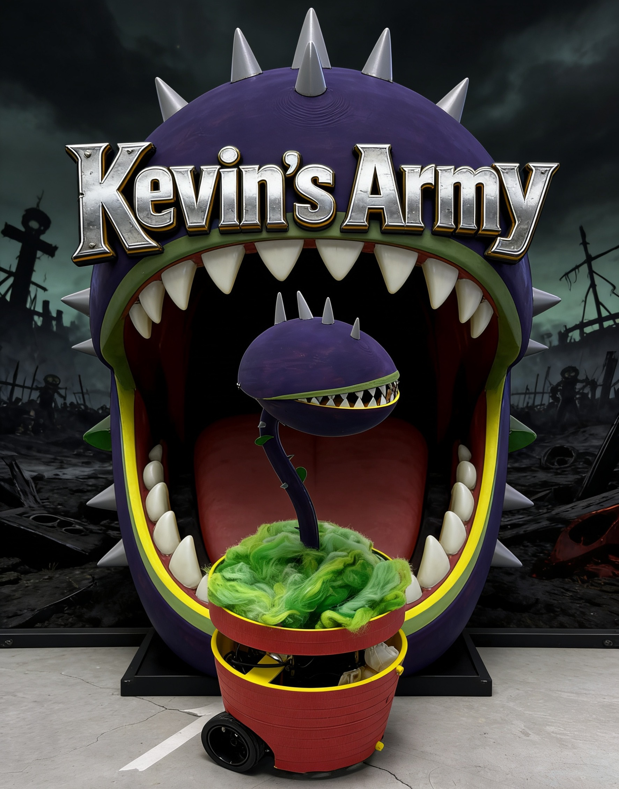

# 🌿 Patrol Robot — Makerspace Laser Engraver Safety Monitor

> A TurtleBot3 Waffle with a carnivorous plant aesthetic that autonomously patrols a makerspace, detects unattended Glowforge laser engravers, and alerts supervisors.

---

## 📸 Robot Photo



---

## 🎥 Demo Video

[▶ Watch the demo](https://drive.google.com/file/d/19d0dIF1H4FnUx9gYyEMpu0TyJhAPzDzj/view?usp=sharing)

---

The patrol robot monitors 6 Glowforge laser engravers on the 2nd floor of the GIX makerspace. When a machine starts running, the robot autonomously navigates to it, opens its motorized "mouth" to reveal a camera, scans for human presence using YOLOv8, and sends an email alert if the machine is running unsupervised.

The body is designed to resemble a carnivorous plant: the camera is hidden inside a hinged "mouth" that only opens when the robot arrives at a machine. This keeps the sensor protected during transit and creates a clear visual cue when the robot is scanning.

### Key Features

- **Autonomous patrol** via Nav2 navigation on a pre-mapped environment
- **Glowforge API integration** — polls machine status every 10 seconds
- **YOLO human detection** — confirms presence across 10 frames within 2 seconds (7/10 threshold)
- **Motorized mouth** — Dynamixel motor conceals and reveals the camera
- **Stuck recovery** — LiDAR-based obstacle escape with up to 5 retry attempts
- **Multi-machine support** — visits multiple running machines in sequence without returning home between stops
- **Audio alert** — espeak TTS via Bluetooth speaker when no human is detected
- **Simulation mode** — full end-to-end testing without real Glowforge machines

---

## 🤖 Hardware

| Component | Details |
|-----------|---------|
| Base platform | TurtleBot3 Waffle |
| Motor controller | OpenCR board |
| Compute (robot) | Raspberry Pi 4 |
| LiDAR | LDS-02 |
| Wheel motors | Dynamixel XM430-W210 (×2) |
| Camera motor | Dynamixel XL430-W250-T |
| Camera | USB camera via v4l2 |

---

## 👥 Team & Work Split

TECHIN 516 — Winter 2025, University of Washington GIX

| Name | GitHub | Contributions |
|------|--------|---------------|
| **Jason Jin** | [@jhx19](https://github.com/jhx19) | Project architecture, ROS2 package setup, Nav2 integration & stuck recovery (`navigator.py`), Glowforge API monitor (`glowforge_monitor.py`), state machine (`main_demo.py`), alert system (`alert_sender.py`, `audio_alert.py`), credentials management, devcontainer & Dockerfile, launch file, URDF & RViz config, README |
| **Lya Liu** | [@peanuthater](https://github.com/peanuthater) | Dynamixel motor integration (`motor_controller.py`), motor hardware testing, Dynamixel firmware troubleshooting, joint trajectory tuning (open/close positions and timing), physical mouth mechanism design and assembly |
| **Yuhang Sun** | [@yhsunhelen](https://github.com/yhsunhelen) | Human detection system (`human_detection_service.py`, `human_detector.py`), YOLOv8n ONNX export and ARM deployment, multi-frame detection logic, confidence threshold tuning, camera integration and testing on Raspberry Pi |

---

## 🧠 Software Architecture

### State Machine

```
┌─────────────────────────────────────────────────────────┐
│                                                         │
│   ┌──────┐    machine      ┌────────────┐               │
│   │      │   running &     │            │               │
│   │ IDLE │ time_left > 10s │ NAVIGATING │               │
│   │      │────────────────▶│            │               │
│   └──────┘                 └────────────┘               │
│      ▲                           │                      │
│      │                    arrived│                      │
│      │                    + open │mouth                 │
│      │                           ▼                      │
│      │                     ┌──────────┐                 │
│      │    no other machine │          │                 │
│      │◀────────────────────│ SCANNING │                 │
│      │     go home         │          │                 │
│   ┌──────────┐             └──────────┘                 │
│   │          │                   │                      │
│   │RETURNING │◀──────────────────┘                      │
│   │          │  close mouth                             │
│   └──────────┘  check next machine                      │
│        │                                                │
│        │ another machine running                        │
│        └──────────────────▶ NAVIGATING                  │
│                                                         │
└─────────────────────────────────────────────────────────┘
```

### ROS2 Nodes

| Node | Runs on | Description |
|------|---------|-------------|
| `turtlebot3_bringup` | Raspberry Pi | Base robot drivers, OpenCR, wheel motors |
| `v4l2_camera_node` | Raspberry Pi | Camera feed → `/image_raw` |
| `human_detection_service` | Raspberry Pi | YOLO ONNX inference, `/detect_human` service |
| `robot_state_publisher` | Remote PC | Broadcasts URDF on `/robot_description` |
| `nav2` stack | Remote PC | Map server, AMCL, planner, controller |
| `patrol_robot` | Remote PC | Main state machine |
| `rviz2` | Remote PC | Visualization |

### Module Summary

**`glowforge_monitor.py`** — Authenticates with the Glowforge web API using CSRF token scraping. Polls `api.glowforge.com/gfcore/users/machines` and filters to 6 monitored 2F machines by serial number. Returns machines where `state == printing`, `time_remaining < duration`, and `time_remaining > 10`.

**`navigator.py`** — Wraps the Nav2 `NavigateToPose` action client. Loads waypoints from `config/waypoints.yaml`. Blocks on `threading.Event` while spinning. Runs a 2Hz stuck watchdog — if the robot moves less than 8cm and rotates less than 0.12 rad over 6 seconds, it triggers a LiDAR-based escape manoeuvre (rotate away from nearest obstacle → drive forward 1.5s → re-send goal), up to 5 attempts.

**`human_detection_service.py`** — ROS2 service node. On each `/detect_human` call, clears stale frames then collects 10 distinct frames from `/image_raw` within 2 seconds using a `queue.Queue`. Runs YOLOv8n ONNX inference on each frame with letterbox preprocessing. Confirms human presence if **7 or more** of the 10 frames detect a person (class 0, confidence ≥ 0.5).

**`motor_controller.py`** — Publishes `JointTrajectory` messages to `/gix_controller/joint_trajectory` for the `gix` joint. Open position: `-1.0 rad`. Closed position: `-1.8 rad`. 1.5-second motion duration with a 0.5s buffer sleep.

**`alert_sender.py`** — Gmail SMTP alert via `starttls`. Resolves the operator's email from a username→email map, falling back to the default recipient. Sends machine name, operator username, job title, and time remaining. Credentials loaded from `config/credentials.yaml`.

**`audio_alert.py`** — espeak TTS playback via the default PulseAudio sink (Bluetooth speaker). Falls back to `festival` if espeak is unavailable. Repeats the safety announcement twice.

**`main_demo.py`** — State machine orchestrator. Accepts `sim_data_file` ROS2 parameter for simulation mode. Loads Glowforge credentials from `config/credentials.yaml`. In RETURNING, re-polls Glowforge and routes directly to the next running machine, skipping the home waypoint.

**`credentials.py`** — Utility loader. Reads `config/credentials.yaml` via `ament_index_python.get_package_share_directory()` and returns a dict used by `main_demo.py` and `alert_sender.py`.

---

## 🗺️ Monitored Machines

| Serial | Display Name | Waypoint |
|--------|-------------|----------|
| `WYC-332` | Glowforge-2F-01 | `glowforge_001` |
| `VVD-329` | Glowforge-2F-02 | `glowforge_temp` |
| `RRV-334` | Glowforge-2F-03 | `glowforge_003` |
| `JRM-724` | Glowforge-2F-04 | `glowforge_004` |
| `HVW-296` | Glowforge-2F-05 | `glowforge_005` |
| `HCK-847` | Glowforge-2F-06 | `glowforge_006` |

---

## ⚙️ Setup

### Option A — Dev Container (Recommended)

The repo includes a `.devcontainer` configuration. Anyone with Docker and VS Code can be up and running without manually installing ROS2 or any dependencies.

**Prerequisites:**
- [Docker Desktop](https://www.docker.com/products/docker-desktop/)
- [VS Code](https://code.visualstudio.com/) with the [Dev Containers extension](https://marketplace.visualstudio.com/items?itemName=ms-vscode-remote.remote-containers)

```bash
# 1. Clone the repo
git clone <your-repo-url>
cd patrol_robot

# 2. Open in VS Code
code .

# 3. When prompted "Reopen in Container", click Yes
#    (or press F1 → "Dev Containers: Reopen in Container")
#
# The container will:
#   - Install ROS2 Humble + all system dependencies
#   - Install Python deps (onnxruntime, requests, etc.)
#   - Build the patrol_robot package automatically
#   - Source the workspace in every new terminal
```

### Option B — Manual Install

**Prerequisites:**
- Ubuntu 22.04 on Remote PC
- ROS2 Humble installed on both Remote PC and Raspberry Pi
- TurtleBot3 packages installed
- Passwordless SSH from Remote PC to Pi

```bash
# Set up passwordless SSH (run once on Remote PC)
ssh-keygen -t ed25519
ssh-copy-id ubuntu@<robot_ip>
```

**Environment variables** — add to `~/.bashrc` on **both** Remote PC and Pi:

```bash
export TURTLEBOT3_MODEL=waffle
export LDS_MODEL=LDS-01
export ROS_DOMAIN_ID=38
```

**Install Python dependencies on Pi:**

```bash
pip install onnxruntime opencv-python beautifulsoup4 requests --break-system-packages
```

**Build:**

```bash
cd ~/turtlebot3_ws/src
git clone <https://github.com/jhx19/patrol_robot.git>
cd ~/turtlebot3_ws
colcon build --packages-select patrol_robot --symlink-install
source install/setup.bash
```

### Credentials Setup

The repo includes `config/credentials.yaml.example` with placeholder values. Copy it and fill in your own:

```bash
cp config/credentials.yaml.example config/credentials.yaml
```

Then edit `config/credentials.yaml`:

```yaml
glowforge:
  email:    'your_glowforge_email@example.com'
  password: 'your_glowforge_password'

gmail:
  sender_email:    'your_gmail@gmail.com'
  sender_password: 'your_16_char_app_password'   # Gmail App Password
  recipient_email: 'recipient@uw.edu'
```

> ⚠️ `credentials.yaml` is listed in `.gitignore` and will never be committed. Only `credentials.yaml.example` is tracked by git.

> Generate a Gmail App Password at: Google Account → Security → 2-Step Verification → App Passwords

### ONNX Model Setup

Export YOLOv8n to ONNX on the Remote PC, then copy to the Pi:

```bash
# On Remote PC (or inside the dev container)
pip install ultralytics
python3 -c "from ultralytics import YOLO; YOLO('yolov8n.pt').export(format='onnx')"
scp yolov8n.onnx ubuntu@<robot_ip>:~/turtlebot3_ws/
```

> ⚠️ `*.onnx` files are listed in `.gitignore`. The model must be generated and copied manually.

---

## 🗺️ Mapping

```bash
# Terminal 1 — Pi
ssh ubuntu@<robot_ip>
ros2 launch turtlebot3_bringup robot.launch.py

# Terminal 2 — Remote PC (or inside container)
ros2 launch turtlebot3_cartographer cartographer.launch.py use_sim_time:=false

# Terminal 3 — Remote PC (drive to map the space)
ros2 run turtlebot3_teleop teleop_keyboard

# Terminal 4 — Remote PC (save when satisfied)
ros2 run nav2_map_server map_saver_cli -f ~/turtlebot3_ws/src/patrol_robot/maps/gix_map
```

> ⚠️ Map files (`maps/*.pgm`, `maps/*.yaml`) are listed in `.gitignore`. After saving, commit them explicitly if you want to share with teammates:
> ```bash
> git add -f maps/gix_map.pgm maps/gix_map.yaml
> ```

---

## 🚀 Usage

### Single command launch

```bash
# Real mode
ros2 launch patrol_robot demo.launch.py

# With custom robot IP
ros2 launch patrol_robot demo.launch.py robot_ip:=<robot_ip>

# Simulation — one machine running
ros2 launch patrol_robot demo.launch.py sim_data:=sim1.json

# Simulation — two machines running (tests skip-home logic)
ros2 launch patrol_robot demo.launch.py sim_data:=sim2.json
```

### Launch sequence

| Time | Action | Where |
|------|--------|-------|
| t = 0s | Robot bringup + camera | Pi (SSH) |
| t = 5s | Nav2 stack (map, AMCL, planners) | Remote PC |
| t = 10s | Human detection service (YOLO) | Pi (SSH) |
| t = 12s | Motor power enable | Pi (SSH) |
| t = 18s | RViz | Remote PC |
| t = 20s | Patrol robot state machine | Remote PC |

### Teleoperation

```bash
ros2 run turtlebot3_teleop teleop_keyboard
```

---

## 🧪 Testing

### Test Glowforge monitor

```bash
cd ~/turtlebot3_ws/src/patrol_robot
python3 - <<'EOF'
from patrol_robot.glowforge_monitor import GlowforgeMonitor
m = GlowforgeMonitor('your@email.com', 'password')
m.login()
print(m.get_running_machines())
EOF
```

### Test motor

```bash
# Enable motor power first
ros2 service call /motor_power std_srvs/srv/SetBool "{data: true}"

# Open mouth (-1.0 rad)
ros2 topic pub --once /gix_controller/joint_trajectory \
  trajectory_msgs/msg/JointTrajectory \
  "{joint_names: ['gix'], points: [{positions: [-1.0], time_from_start: {sec: 2}}]}"

# Close mouth (-1.8 rad)
ros2 topic pub --once /gix_controller/joint_trajectory \
  trajectory_msgs/msg/JointTrajectory \
  "{joint_names: ['gix'], points: [{positions: [-1.8], time_from_start: {sec: 2}}]}"
```

### Test human detection

```bash
# Call the service manually (with camera running)
ros2 service call /detect_human std_srvs/srv/Trigger {}

---

## 📁 Package Structure

```
patrol_robot/
├── .devcontainer/
│   ├── Dockerfile                  # ROS2 Humble + all dependencies
│   └── devcontainer.json           # VS Code dev container config
├── config/
│   ├── waypoints.yaml              # home + 6 Glowforge waypoints
│   ├── patrol_robot.rviz           # RViz configuration
│   ├── credentials.yaml            # ⚠️ gitignored — fill in your own values
│   └── credentials.yaml.example    # committed template with placeholders
├── launch/
│   └── demo.launch.py              # single-command launch
├── maps/
│   ├── gix_map.pgm                 # ⚠️ gitignored — generated by Cartographer
│   └── gix_map.yaml                # ⚠️ gitignored — generated by Cartographer
├── urdf/
│   └── patrol_robot.urdf.xacro     # robot description (custom plant body + gix joint)
├── patrol_robot/
│   ├── main_demo.py                # state machine
│   ├── glowforge_monitor.py        # Glowforge API + sim mode
│   ├── navigator.py                # Nav2 + stuck recovery
│   ├── human_detection_service.py  # YOLO ONNX service node
│   ├── motor_controller.py         # Dynamixel mouth control
│   ├── human_detector.py           # /detect_human service client
│   ├── alert_sender.py             # Gmail SMTP alert
│   ├── audio_alert.py              # espeak / festival TTS alert
│   └── credentials.py             # credentials.yaml loader
├── test/
│   ├── sim1.json                   # sim: 1 machine running
│   └── sim2.json                   # sim: 2 machines running
├── .gitignore
├── LICENSE
├── package.xml
├── setup.py
└── setup.cfg
```

---

## 🔑 Key Technical Notes

- **ONNX Runtime on ARM** — PyTorch is not compatible with Raspberry Pi ARM architecture. YOLOv8n is exported to ONNX on the Remote PC and run via `onnxruntime` on the Pi.
- **Post-build path resolution** — `waypoints.yaml`, `credentials.yaml`, and map files are resolved using `ament_index_python.get_package_share_directory()`, not `__file__`-relative paths.
- **Dynamixel motor faults** — if the motor stops responding, use Dynamixel Wizard to clear the Shutdown register before reflashing GIX firmware. The GIX firmware plays a distinct startup melody to confirm it's loaded correctly.
- **Nav2 goal timing** — the navigator waits for the Nav2 action server before sending any goal, preventing silent rejections on startup.
- **AMCL initial pose race** — the launch file retries `/initialpose` every 2 seconds until the `map→odom` TF appears. A single publish is unreliable because AMCL's subscription is not guaranteed to be ready when the service first becomes visible.
- **Motor power** — must be explicitly enabled after bringup via the `/motor_power` service call (handled automatically by the launch file at t=12s).
- **Credentials security** — `config/credentials.yaml` is gitignored. The committed `credentials.yaml.example` contains only placeholder values. Never commit your actual credentials.
- **YOLOv8 license** — the model is AGPL-3.0. The `.onnx` file is generated and transferred manually and is not distributed in this repository.

---

## 📄 License

This project is licensed under the **MIT License** — see [LICENSE](LICENSE) for details.

Note: The YOLOv8n model (not included in this repo) is subject to the **AGPL-3.0** license. See `LICENSE` for full third-party dependency information.